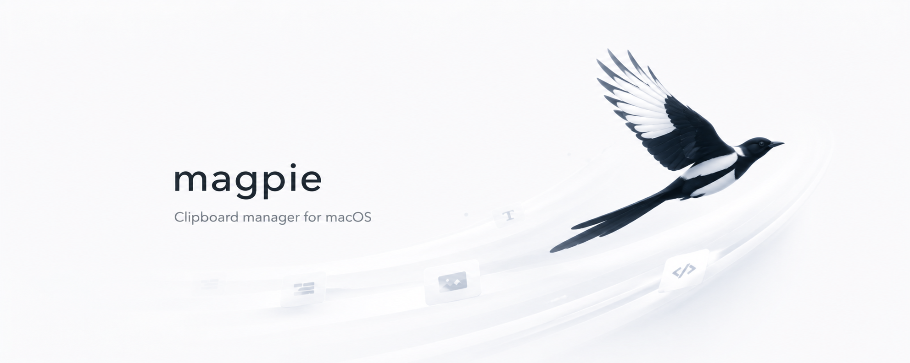

  

<h1 align="center">Magpie</h1>

  一个基于 Tauri、React 和 Rust 构建的快速、现代的剪贴板管理器。

  <a href="./README.md">English</a> | <a href="./README.zh-CN.md">简体中文</a>

## 许可证

基于 [GPL-3.0](./LICENSE) 许可证开源 · © 2026 [Kirk Lin](https://github.com/kirklin)
